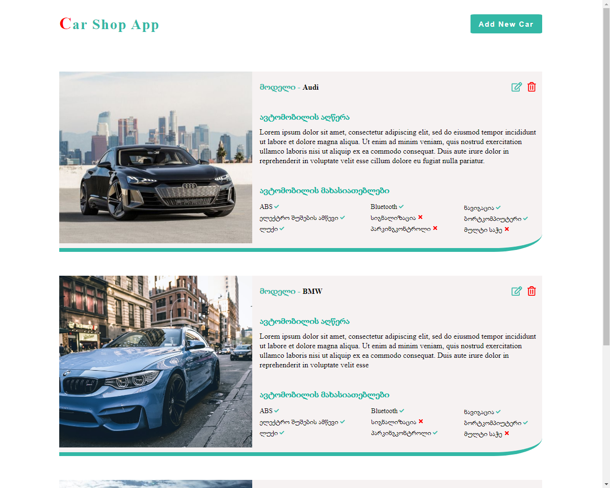
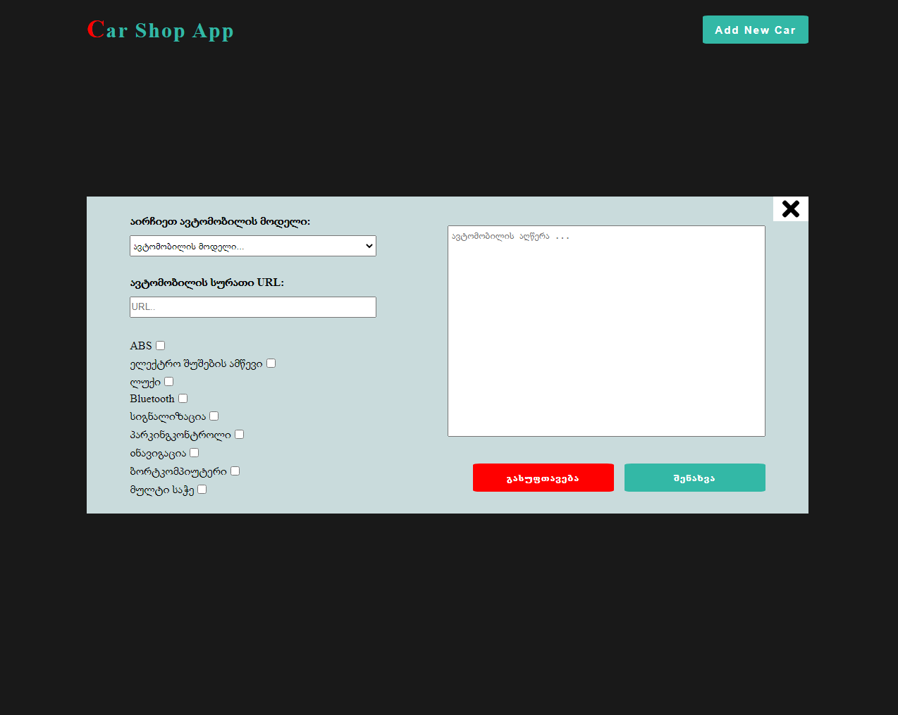

# Car Shop App





- Car Shop App
    - you can add new car 
    - you can change car: model , image , Features and car description
    - you can delete car

- to get json server data /  Start JSON Server use
    ```bash
        json-server --watch data/db.json
    ```
    or
    ```bash
        npx json-server --watch data/db.json
    ```

- read more about full fake REST API
    - https://github.com/typicode/json-server
